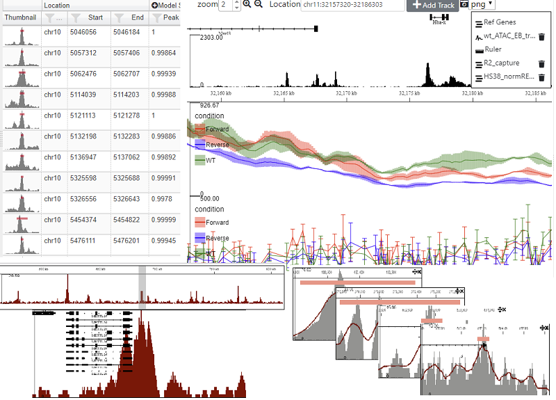

# MLVPanel

MLVPanel (Multi Locus View) is a flexible lightwight JavaScript component, allowing the visualization of multiple genomic locations simultaneously. 
It is heavily based on the excellent [igv.js](https://github.com/igvteam/igv.js) browser,but has the following functionality:-

* Multiple tracks of different types can be displayed compactly in the same panel.
* Multiple panels displaying different genomic locations can be displayed on the same page.
* Panels can be linked together through callbacks.
* Tracks are easily extensible, making creation of custom tracks straight forward.
* Command line tool (node.js) for generating multiple images (svg, pdf or png) from a list of locations




## Quick Start

Just copy dist/mvl_panel.js and put the  dist/images directory in the same directory as your html page. Then just import mlv_panel.js in
a <script> tag - see [example1](examples/example1.html). Older browsers may also require polyfills.

MLVPanel is written in pure ES6 javascript and hence will work in modern browsers without the need to build from the source code - see
[example 2](examples/example2.html). Although not practical for production, this does allow you to edit the the code in realtime in 
the browser.

## Building from Source
The source files are bundled together, minified and converted to legacy javascript using [webpack](https://webpack.js.org/). 
For a standard build cd to the base directory and use the following command (assuming you have webpack installed)
```
webpack --config mlv_panel_config.js
```
The [index file](src/indexes/mlv_panel_index.js) specified in the config simply imports the required css files and javascript modules 
and exposes certain modules by attaching them to the window object.

## Documentation
Documentation can be found on the [wiki](https://github.com/Hughes-Genome-Group/MLVPanel/wiki).
